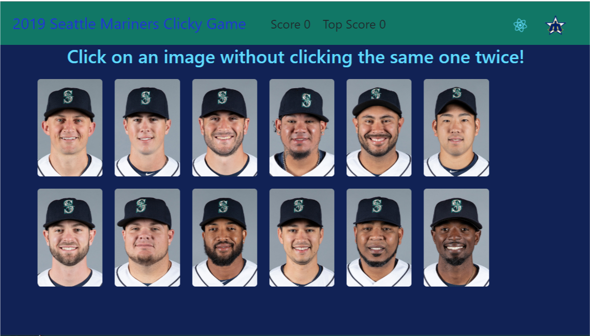
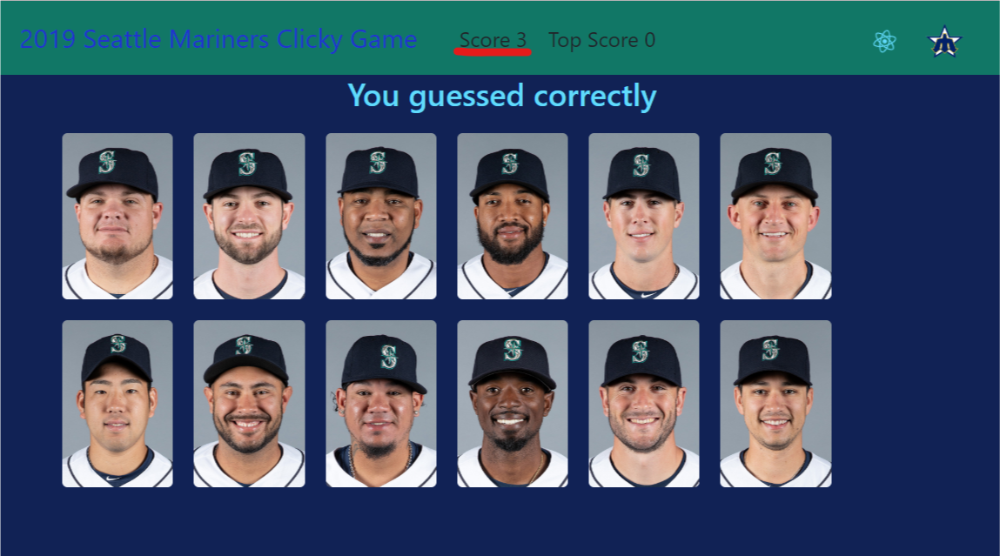
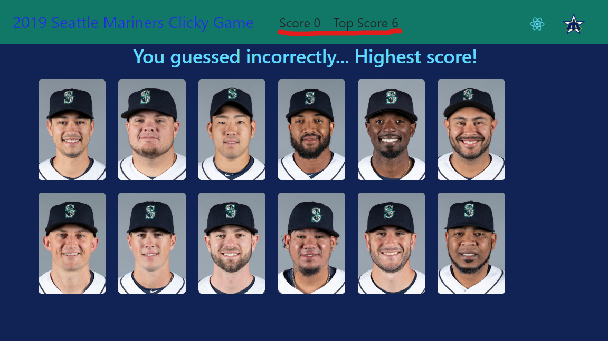

# Clicky Game -- 2019 Seattle Mariners Edition

<!-- ### Draft Version: dev work still in progress :construction: 
* Due Thursday, March 7 -->

## Overview

* This is a memory game web application using React. 

## Objectives

* Develop a memory game web app using React. 
* Break up application's UI into components, manage component state, and respond to user events.

## Deployment

* Live app @ GitHub 
  * https://mmakino.github.io/clicky-game
 
* GitHub Repository
  * https://github.com/mmakino/clicky-game

## Game Rule 

* Click on any of pictures to earn a point, but do not click on the same picure twice.
* Each time when a picture is clicked, positions of the pictures will be shuffled.

### Intallation

* This app can also be installed __locally__ through the following steps 

1. Clone the git repository
    ```
    git clone https://github.com/mmakino/clicky-game.git
    ```
1. Install necessary packages
    ```
    npm install
    ```
    * This app uses the following NPM packages:
    ```
    "gh-pages": "^2.0.1",
    "react": "^16.8.3",
    "react-dom": "^16.8.3",
    "react-scripts": "2.1.5"
    ```
1. Start the web server
    ```
    npm start
    ```
1. The web page should open in a browser automatically. If it does not, try entering the following URL into the address bar to start devlopment http web server.
    ```
    http://localhost:3000/
    ```

### Game Snapshots

* Initial screen
    [](https://mmakino.github.io/clicky-game)

* The `Score` increses while same images are not clicked
    [](https://mmakino.github.io/clicky-game)

* The `Score` resets when the same image is clicked. If it's the highest score, `Top Score` is updated.
    [](https://mmakino.github.io/clicky-game)

## About the MLB player images

* All the images of the players are hyperlinks at the official MLB site
  * http://m.mlb.com/sea/roster
* Therefore they are subject to the copyright of 2019 MLB Advanced Media, LP. 
    
#### Written by [Motohiko Makino](https://mmakino.github.io/)

